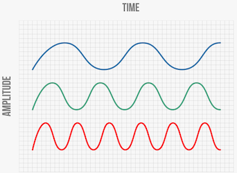

```{r setup, include=FALSE}
knitr::opts_chunk$set(echo = FALSE)
source("3_processing.R")
source("5_theme.R")
library(shiny)
library(plotly)
```

## Introduction

```{r}

ggplot() +
  geom_line(data = QNA_Tou_dt,
            aes(x = as.Date.yearmon(Period), y = Value, color = Variable),
            size = 0.5) +
  scale_x_date(date_breaks = "3 year", date_labels = "%Y") +
  scale_y_continuous(pretty_breaks(n=10)) +
  scale_color_manual(values = cols) +
  theme(axis.title = element_blank(),
        legend.title = element_blank(),
        legend.position='none') +
  labs(title = "Quarterly GDP (QGDP) vs. Gross Value Added (GVA) by Tourism, 2003 - 2020") +
  facet_grid(Variable~., scales = "free_y") -> p

ggplotly(p, width = 900, height = 600)

```


## Introduction

- The output gap is defined as the difference between the actual and potential output or GDP, where the potential GDP is what can be produced if the economy is at full employment level or at the natural rate of unemployment.

- Uses of potential output and the output gap:
  + Point out the position of the economy within the cycle
  + Evaluate medium and long term growth
  + Required for most macroeconomic models that are used for forecasting and policy analysis
  + Useful indicator of fiscal policy stance
  + Needed to estimate the cyclically adjusted government budget balances
  + Featured prominently in the Taylor rule when setting interest rates under monetary policy


## Introduction

- Challenges:
  + Calculation and evaluation of the methods is problematic as neither of these variables are directly observed
  + Sensitive to the model specifications, the method of estimation and the time
horizon, leading to the economic policies being based on estimates
  + Output gap estimates are crucial for policy making in real-time, the estimates in real-time could be subjected to revisions as new data becomes available


## Data

- Source: National Bureau of Statistics
  + Data: Seasonally unadjusted Quarterly National Accounts
  + Period: Q1-2003 to Q1-2020
  + Observations: 69

- Ideally, we would have seasonally adjusted quarterly GDP data with more observations

- In the absence of this, preliminary seasonal adjustment was carried out
  + Procedure: X-13-ARIMA-SEATS
  + Software: `JDemetra+` on `R`
  + Official recommendation by the European Statistical System
  + Comparisons with STL decomposition and X-11-ARIMA and a second implementation of X-13-ARIMA in `R` and found only minor differences

## Data

```{r}
x13_model[["final"]][["series"]][, "y"] -> x13_y
x13_model[["final"]][["series"]][, "t"] -> x13_t
x13_model[["final"]][["series"]][, "s"] -> x13_s
x13_model[["final"]][["series"]][, "i"] -> x13_i

data.table("Period" = time(x13_t) %>% as.yearqtr(),
           "data" = x13_y,
           "trend" = x13_t,
           "seasonal" = x13_s,
           "irregular" = x13_i) %>%
  melt(., id.var = "Period", variable.name = "Variable", value.name = "Value") %>%
  ggplot() +
  geom_line(aes(x = as.Date.yearqtr(Period), y = Value),
            size = 0.5, color = cols[1]) +
  scale_y_continuous(breaks = pretty_breaks(n=5),
                     labels = comma) +
  scale_x_date(date_breaks = "2 year", date_labels = "%Y") +
  facet_grid(Variable ~., scales = "free_y") +
  theme(axis.title = element_blank(),
        legend.title = element_blank()) +
  labs(title = "Time series properties of QNA using X13-ARIMA-SEATS decomposition") -> p

ggplotly(p, width = 900, height = 600)

```

## Data

```{r}
p1 <- QNA_ts %>%
  ggmonthplot() +
  scale_y_continuous(breaks = pretty_breaks(n=10),
                     labels = comma) +
  theme(axis.title = element_blank(),
        legend.title = element_blank()) +
  ggtitle("  Seasonally unadjusted QNA")

p2 <- QNA_sa %>%
  ggmonthplot() +
  scale_y_continuous(breaks = pretty_breaks(n=10),
                     labels = comma) +
  theme(axis.title = element_blank(),
        legend.title = element_blank()) +
  ggtitle("  Seasonally adjusted QNA")

grid.arrange(p1,p2, ncol = 2)

```


## Methodology

- Three issues complicate the estimation of the output gap:
  + Quarterly GDP data are revised
  + Hindsight may clarify our position in the business cycle
  + Model may be revised with additional data

- Univariate vs Multivariate:
  + The additional information incorporated into multivariate methods are useful in principle <br>
  + The added complexity introduces additional sources of parameter uncertainty and instability which offset any improvements in real time

- Focus on univariate methods


## Methodology: Deterministic Trends

- Linear trend: $y_t = \beta_0 + \beta_1 t + \epsilon_t$
- Quadratic trend: $y_t = \beta_0 + \beta_1 t + \beta_2 t^2 + \epsilon_t$
- Piecewise trend: $y_t = \beta_0 + \beta_1 t + \beta_2 t\ \mathbf{1}[t > t_b] + \epsilon_t$

```{r, warning = FALSE}

copy(trend_final) %>%
  .[Vintage == v & Method %in% c("Linear", "Quadratic", "Piecewise"), !"Vintage"] %>%
  .[, "Type" := "Trend"] -> dt1

copy(cycle_final) %>%
  .[Vintage == v & Method %in% c("Linear", "Quadratic", "Piecewise"), !"Vintage"] %>%
  .[, "Type" := "Cycle"] -> dt2

data.table("Period" = time(QNA_sa) %>% as.yearqtr(),
           "Value" = as.numeric(QNA_sa),
           "Method" = "QNA", 
           "Type" = "Trend") -> dt3

rbind(dt3, dt1, dt2) %>%
  ggplot() +
  geom_line(aes(x = as.Date.yearqtr(Period), y = Value, color = Method),
            size = 0.5) +
  scale_x_date(date_breaks = "3 year", date_labels = "%Y") +
  scale_y_continuous(pretty_breaks(n=10)) +
  scale_color_manual(values = cols) +
  theme(axis.title = element_blank(),
        legend.title = element_blank()) +
  labs(title = "Deterministic trends: Trend and Cyle") +
  facet_wrap(~Type, scales = "free_y") -> p

ggplotly(p, width = 900)

```


## Methodology: Hodrick-Prescott (HP) Filter

$\min_{\{g_t\}^T_{t=-1}} \{ \sum^T_{t=1} (y_t - g_t^2) + \lambda \sum^T_{t=1} [(g_t - g_{t-1}) - (g_{t-1} - g_{t-2})]^2 \}$

```{r, include = FALSE}
min <- 0
max <- 5000
step <- 200

seq(min, max, step) -> seq_loop

plot_list <- list()
for (i in seq_loop){
  
  hpfilter(QNA_sa, type = "lambda", freq = i, drift = FALSE) -> HP
  HP[["trend"]] -> Trend
  HP[["cycle"]] -> Cycle
  
  data.table("Period" = time(Trend) %>% as.yearmon(),
             "QNA" = as.numeric(QNA_sa),
             "Trend" = as.numeric(Trend),
             "Cycle" = as.numeric(Cycle),
             "Freq" = i) -> dt
  
  plot_list[[as.character(i)]] <- dt
}
rbindlist(plot_list) %>%
  melt(., id.var = c("Period", "Freq"), variable.name = "Variable", value.name = "Value") -> plot_main_dt

plot_main_dt[Variable %in% c("QNA", "Trend"), "Chart" := "Trend"]
plot_main_dt[Variable == "Cycle", "Chart" := "Cycle"]
```

```{r, cache = FALSE}
inputPanel(
  sliderInput("lambda", label = "Lambda value:",
              min = min, max = max, value = 200, step = step)
)

renderPlot({
  plot_main_dt[Freq == input$lambda] -> plot_dt
  
  ggplot() +
    geom_line(data = plot_dt,
              aes(x = as.Date.yearmon(Period), y = Value, color = Variable),
              size = 1) +
    scale_x_date(date_breaks = "2 year", date_labels = "%Y") +
    scale_y_continuous(pretty_breaks(n=10)) +
    scale_color_manual(values = cols) +
    theme(axis.title = element_blank(),
        legend.title = element_blank()) +
    labs(title = "HP Filter: Trend and Cyle") +
    facet_wrap(~Chart, scales = "free_y")
  
})
```


## Methodology: Bandpass (BP) Filter

- Time series can be decomposed into components corresponding different frequencies, and isolate the components corresponding with the frequencies of the “business cycle”

```{r, fig.align='center'}

```

- Exclude fluctuations at very high frequencies like seasonal components and at very low frequencies which are assumed to correspond with the long-run
  + Common practice: Target frequencies between 6 and 32 quarters
  + Alternatively: Target frequencies between 4 and 28 quarters


## Methodology: Issues in HP and BP Filter

- Spurious cycle effect
- End-point problems
- Largely arbitrary values for smoothing
  + HP Filter: Smoothing parameter, $\lambda$
  + Bandpass: Targetted frequency

### Commonly recommended solution:
- Padding the data with forecasts
  + However, minimal changes observed from padding


## Methodology: Beveridge-Nelson (BN) Filter

- Beveridge-Nelson Decomposition
  + Based on the assumption that in the long run the cyclical component would die out, and all that will be left is the trend
  + Define trend as simply the long-run forecast

- Beveridge-Nelson Filter
  + Bayesian estimation of an AR(p) model as its forecast model to estimate the long-run trend
  + Bayesian estimation allows us to use higher orders of lags in the models but shrink the "importance" or "weight" given to lags from further back
  + Amplitude-to-noise ratio is optimized automatically to maximize the amplitude of the cycles


## Methodology: Beveridge-Nelson (BN) Filter Configurations

- Demeaned using sample mean
  + Default configuration
  + When no evidence of structural break

- Piecewise demeaning
  + Providing specific break dates
  + Used when we have evidence of specific breaks at specific dates

- 40-window demeaning procedure
  + Guards against structural breaks in real time


## Experiment: Revision properties

- Data: Earliest vintage is Q4-2017, most recent is Q1-2020
- Fairly long period of revisions in QNA due to additional source data and benchmarking
- As the revisions due to benchmarking would be very small, use a revision triangle to isolate the point at which additional source data stops
  
```{r}

order <- MAR[order(word(Estimate_number, 1) %>% as.numeric()), Estimate_number] %>% as.character()
max_limit <- plyr::round_any(max(MAR[,MAR]), f = ceiling, accuracy = 0.2)

ggplot() +
  geom_bar(data = MAR,
           aes(x = factor(Estimate_number, levels = order), y = MAR),
           stat = "identity", fill = cols[1], width = 0.5) +
  scale_y_continuous(breaks = seq(0, max_limit, 0.2),
                     labels = comma,
                     limits = c(0, max_limit)) +
  theme(axis.title = element_blank(),
        legend.title = element_blank()) +
  labs(title = "Mean Absolute Revision (MAR)") -> p

ggplotly(p, height = 300, width = 500)

```

- Key indicators: Root Mean Squared (RMS) revisions and the standard deviation of the revisions; measures of correlation and the proportion of same signs occurring between the two estimates


## Results: Revision properties of the models

```{r}

copy(rev_dtx) -> Tb
recode(Tb$Method,
       "BNF1" = "BN Filter: 40-window Demeaning",
       "BNF2" = "BN Filter: Sample Mean Demeaning",
       "BNF3" = "BN Filter: Manual Break Dates",
       "BP Long" = "BP Filter: 6-32 quarters",
       "BP Short" = "BP Filter: 4-28 quarters",
       "HP" = "HP Filter",
       "Linear" = "Linear Model",
       "Quadratic" = "Quadratic Model",
       "Piecewise" = "Piecewise Model") -> Tb$Method

ggplot() +
  geom_bar(data = Tb[Measure %in% c("Root Mean Square", "Standard Deviation")],
           aes(x = fct_reorder(Method, -Value), y = Value, fill = Measure),
           stat = "identity", position = "dodge", width = 0.75) +
  scale_y_continuous(breaks = pretty_breaks(n=5)) +
  scale_fill_manual(values = cols) +
  coord_flip() +
  theme(axis.title = element_blank(),
        legend.title = element_blank()) +
  labs(title = "Size of Revisions") -> p

ggplotly(p, width = 900, height = 600)

```


## Results: Revision properties of the models

```{r}

ggplot() +
  geom_hline(yintercept = 0, size = 0.25, colour="black") +
  geom_bar(data = Tb[Measure %in% c("Correlation", "Same Sign")],
           aes(x = fct_reorder(Method, Value), y = Value, fill = Measure),
           stat = "identity", position = "dodge", width = 0.75) +
  scale_y_continuous(breaks = pretty_breaks(n=5)) +
  scale_fill_manual(values = cols) +
  coord_flip() +
  theme(axis.title = element_blank(),
        legend.title = element_blank()) +
  labs(title = "Correlation and Sign of Estimates",
       caption = "") -> p

ggplotly(p, width = 900, height = 600)

```


## Experiment: Final output gap estimates

- By analyzing the turning points, as they are presumably the periods when an accurate and timely estimate of the output gap would be of particular interest to policymakers
  
### Defining recessions:
- “Rule of thumb”: two consecutive quarterly declines in real GDP
- Measures used by National Bureau of Economic Research:
  + Personal income less transfer payments, in real terms
  + Payroll employment from the Bureau of Labor Statistics
  + Other indicators: Real personal consumption expenditure, industrial production, initial
claims for unemployment insurance, wholesale-retail sales adjusted for price changes, and
household employment

- Given that most of these measures are unavailable in Maldives, the relatively crude rule of two consecutive declines in quarterly real GDP was used to define and date recessions


## Results: Output gap estimates

```{r}

copy(Growth.QNA.g) -> Tb1

recode(Tb1$Variable,
       "GrowthPrec" = "Preceding",
       "GrowthCorr" = "Corresponding") -> Tb1$Variable

max_limit <- plyr::round_any(max(Tb1[,Value]), f = ceiling, accuracy = 5)
min_limit <- plyr::round_any(min(Tb1[,Value]), f = floor, accuracy = 5)

ggplot() +
  geom_hline(yintercept = 0, size = 0.25, colour="black") +
  geom_rect(data = Recession_Dates_Tb,
            aes(xmin = as.Date.yearqtr(Period_start), xmax = as.Date.yearqtr(Period_end),
                ymin = min_limit, ymax = max_limit), alpha = 0.3) +
  geom_line(data = Tb1,
            aes(x = as.Date.yearqtr(Period), y = Value, color = Variable),
            size = 0.5) +
  scale_x_date(date_breaks = "2 year", date_labels = "%Y") +
  scale_y_continuous(breaks = seq(min_limit, max_limit, 5),
                     limits = c(min_limit, max_limit)) +
  scale_color_manual(values = cols) +
  theme_minimal() +
  theme(axis.title = element_blank(),
        legend.title = element_blank()) +
  labs(title = "Preceding quarter growth rates of seasonally adjusted QNA") -> p

ggplotly(p, width = 900, height = 600)

```

## Results: Output gap estimates

### Expectation:
- Positive correlation between GDP growth and output gap $\uparrow OG = \uparrow Y - \bar{Y}^{*}$
- Negative correlation between GDP growth in the future and current output gap $\downarrow OG_t, \uparrow Y_{t+4}$
  
```{r}

copy(cycle_final) %>%
  .[Vintage == v & str_detect(Method, "BNF1|BP Long")] -> Tb1

copy(Growth.QNA.g) %>%
  .[Variable == "GrowthPrec"] %>%
  .[, "Variable" := "Preceding"] %>%
  setnames(., "Variable", "Method") -> Tb2

rbind(Tb1[, !"Vintage"], Tb2) -> Tb3

max_limit <- plyr::round_any(max(Tb3[, Value]), f = ceiling, accuracy = 5)
min_limit <- plyr::round_any(min(Tb3[, Value]), f = floor, accuracy = 5)

recode(Tb3$Method,
       "BNF1" = "BN Filter: 40-window Demeaning",
       "BP Long" = "BP Filter: 6-32 quarters") -> Tb3$Method

ggplot() +
  geom_hline(yintercept = 0, size = 0.25, colour="black") +
  geom_rect(data = Recession_Dates_Tb,
            aes(xmin = as.Date.yearqtr(Period_start), xmax = as.Date.yearqtr(Period_end),
                ymin = min_limit, ymax = max_limit), alpha = 0.3) +
  geom_line(data = Tb3,
            aes(x = as.Date.yearqtr(Period), y = Value, color = fct_rev(Method)),
            size = 0.5) +
  scale_x_date(date_breaks = "2 year", date_labels = "%Y") +
  scale_y_continuous(breaks = seq(min_limit, max_limit, 5),
                     limits = c(min_limit, max_limit)) +
  scale_color_manual(values = cols) +
  theme_minimal() +
  theme(axis.title = element_blank(),
        legend.title = element_blank()) +
  labs(title = "BN Filter and BP Filter") -> p

ggplotly(p, width = 900, height = 425)

```

## Other discussions

```{r}

max_limit <- plyr::round_any(max(BNF_full[, UB_95]), f = ceiling, accuracy = 5)
min_limit <- plyr::round_any(min(BNF_full[, LB_95]), f = floor, accuracy = 5)

ggplot(data = BNF_full) +
  geom_hline(yintercept = 0, alpha = 0.5) +
  geom_line(aes(x = as.Date.yearqtr(Period), y = Cycle), color = cols[1]) +
  geom_ribbon(aes(x = as.Date.yearqtr(Period), ymin = LB_95, ymax = UB_95),
              fill = cols[1], alpha = 0.2) +
  geom_ribbon(aes(x = as.Date.yearqtr(Period), ymin = LB_80, ymax = UB_80),
              fill = cols[1], alpha = 0.2) +
  scale_x_date(date_breaks = "2 year", date_labels = "%Y") +
  scale_y_continuous(breaks = seq(min_limit, max_limit, 5),
                     limits = c(min_limit, max_limit)) +
  theme_minimal() +
  theme(axis.title = element_blank(),
        legend.title = element_blank()) +
  labs(title = "Estimated Output Gap from the BN Filter with 80% and 95% Confidence Bands",
       subtitle = "",
       caption = "") -> p

ggplotly(p, width = 900, height = 600)

```

## Conclusion

### Major contributions:
- Preliminary seasonally adjusted QNA
- Output gap estimates
- Automated the processes of these to integrate into policy-making
- Risks of using corresponding quarterly growth rates
- Data gaps

### Future research:
- Multivariate methods could be examined with the recommended method as a benchmark
- Important bridge for additional macroeconomic research

# Thank you
